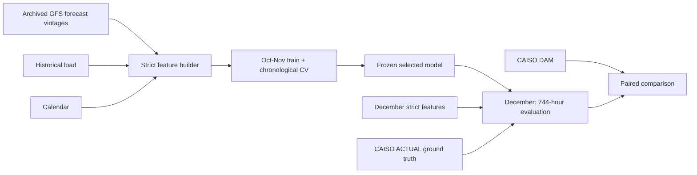

# Leakage-safe CAISO day-ahead load forecasting

This repository evaluates machine-learning models for **next-day electricity-demand forecasting** in the California Independent System Operator (CAISO) area. “Day-ahead” means issuing every hourly forecast for a Pacific operating day before that day begins. The strict workflow uses only information that would genuinely have been available when the forecast was frozen; it does not let a historical experiment see the target day's observed weather or load.

## Key result

> **On the held-out 744 hours of December 2025, Ridge regression achieved 1,580.9 MW RMSE versus 2,902.3 MW for the published CAISO day-ahead forecast, a 45.5% reduction in RMSE.**

| Context for the headline | Result |
|---|---:|
| Ridge operating-day wins vs raw CAISO DAM | 28 / 31 |
| Ridge RMSE reduction vs train-only linearly calibrated CAISO | 28.1% |
| Ridge RMSE reduction vs previous-week persistence | 3.8%; 95% CI crosses zero |

The **raw CAISO DAM** is the actual operational benchmark. The calibrated CAISO series is a robustness check whose calibration was learned only from October–November; it is not an official CAISO product. Previous-week persistence is a strong naive baseline, and the evidence does **not** establish that Ridge reliably beats it.

## Why a strict backtest is necessary

A forecast for tomorrow cannot use tomorrow's observed weather or tomorrow's realized electrical load. Historical datasets make that mistake easy: a weather value may have a timestamp on the target day while having been observed only after the forecast should have been issued. This is **data leakage**—future information entering a model or selection decision.

The governing rule here is:

> **A feature is legal only if it was available by the frozen forecast cutoff.**

A **frozen origin** is the single time at which the information set for an operating day is locked. A **forecast vintage** is a particular archived weather-model run, identified by initialization time and lead. Checking availability is stricter than merely checking that a value's timestamp belongs to the target day.

The repository's older monthly workflow used retrospective data and remains useful for historical experimentation. Its outputs are **not** strict CAISO day-ahead results and do not support the headline above. See [Legacy retrospective/monthly workflow](#legacy-retrospectivemonthly-workflow).

## Experiment design



October and November provide 1,465 training/model-selection rows. The evaluator completes cross-validation, preprocessing selection, final refitting, and CAISO calibration before it even loads December. December labels are used only for the final score.

## Data sources

### CAISO OASIS

The acquisition script requests benchmark and truth separately from CAISO OASIS so their roles and identifiers cannot be confused:

| Role | `TAC_AREA_NAME` | `XML_DATA_ITEM` | `MARKET_RUN_ID` |
|---|---|---|---|
| Published day-ahead benchmark | `CA ISO-TAC` | `SYS_FCST_DA_MW` | `DAM` |
| Realized target | `CA ISO-TAC` | `SYS_FCST_ACT_MW` | `ACTUAL` |

Products join on unique UTC interval-start keys. Those instants are grouped and reported as `America/Los_Angeles` operating days, including daylight-saving-time (DST) transitions. Actuals are truth, never inputs for their own target hour. The DAM forecast is a comparison series and is not a model feature.

### Archived GFS forecasts

Weather comes from the NSF NCAR GDEX 0.25-degree GFS archive: source `nsf-ncar-gdex-gfs-0p25`, model `gfs-0p25`, dataset `d084001`. These are exact historical forecast runs rather than realized weather or reanalysis.

The acquisition implementation:

1. discovers fresh variable identifiers from the backing object's **OPeNDAP DAS** metadata;
2. requests a small NCSS bounding box around the five population-weighted California stations with `accept=netCDF`, rather than downloading each roughly 500 MB global object;
3. validates the NetCDF-3 signature and reads the local response with xarray's scipy engine;
4. retains the exact subset bytes, request parameters, retrieval time, and a `.nc.provenance.json` sidecar containing its SHA-256 checksum.

On resume, valid cached subsets discover variables locally. A fully valid cache causes zero metadata or download network calls, so it can be revalidated offline.

## Forecast cutoff and information-availability rules

There is one cutoff for each Pacific operating day: **D-1 at 07:00 `America/Los_Angeles`**. Weather is eligible only when:

```text
available_at_utc <= forecast_cutoff_utc
available_at_utc = GFS initialization + 10 hours
availability_policy = gfs_init_plus_10h_v1
```

The 07:00 origin and ten-hour lag are conservative evaluation policies chosen by this repository. They are not assertions about CAISO's internal forecasting workflow, nor is the ten-hour rule claimed to be an authoritative GFS publication timestamp.

The builder also enforces:

- the exact load observation seven UTC days earlier, with its recorded availability strictly before the cutoff;
- no realized/reanalysis weather;
- no target load as an input;
- no CAISO DAM value as an input; and
- one complete eligible GFS cycle across every station, rather than mixing vintages.

Provenance and timing columns remain in strict products for audits, but the evaluator's explicit feature allowlist excludes them.

## Model features

Only these 13 reviewed fields can enter a model:

| Category | Features | Why useful |
|---|---|---|
| Prior demand | `load_previous_week` | Captures the strong weekly demand pattern. |
| Weather forecast | `temperature_2m`, `relative_humidity_2m`, `u_wind_10m`, `v_wind_10m`, `cloud_cover`, `precipitation`, `shortwave_radiation` | Represents weather-driven heating, cooling, and activity effects. |
| Forecast horizon | `forecast_lead_hours` | Lets the model account for changing conditions across the next day. |
| Local time/calendar | `day_of_week`, `is_weekend`, `hour_sin`, `hour_cos` | Represents weekly behavior and the cyclic daily load shape. |

Station weather is population-weighted before modeling. Identifiers, cutoffs, availability times, checksums, coordinates, the target, and CAISO DAM are not predictive features. An unexpected numeric column cannot enter automatically.

## Models and model selection

- **Previous-week persistence:** predicts the exact load from seven days earlier; a strong naive baseline.
- **Linear Regression:** unregularized linear model.
- **Ridge:** standardized linear regression with L2 shrinkage.
- **XGBoost:** regularized gradient-boosted trees.
- **CAISO DAM:** the raw, published operational forecast benchmark.
- **Bias-corrected CAISO:** subtracts CAISO's mean October–November error. **Bias calibration** means estimating a correction from training data; it is a robustness baseline, not an operational CAISO series.
- **Linearly calibrated CAISO:** fits `actual = intercept + slope × CAISO` on October–November only; also a robustness baseline.

Model selection uses three chronological 168-hour validation windows at the end of October–November. Each fold trains on every earlier row, never shuffles time, and fits preprocessing only on that fold's training prefix. Selected models are freshly refit on all 1,465 rows, then December is loaded.

The reference run selected Ridge `alpha=100` and this XGBoost configuration:

```text
max_depth=2, learning_rate=0.03, n_estimators=300,
min_child_weight=8, subsample=0.8, colsample_bytree=0.8,
reg_alpha=0.1, reg_lambda=10.0
```

The evaluator additionally fixes `objective=reg:squarederror`, `random_state=202512`, `n_jobs=1`, and `tree_method=hist`. Generated `run_manifest.json` records the selected parameters and library versions; retain it with every run.

## Validated December 2025 results

| Method | RMSE (MW) | MAE (MW) | MAPE | Bias (MW) |
|---|---:|---:|---:|---:|
| Previous-week persistence | 1643.590 | 1179.913 | 4.750% | +145.292 |
| Linear Regression | 1673.398 | 1343.176 | 5.315% | -754.218 |
| **Ridge** | **1580.886** | **1236.456** | **4.864%** | **-669.262** |
| XGBoost | 1583.368 | 1259.939 | 4.959% | -718.225 |
| CAISO DAM | 2902.306 | 1800.747 | 6.824% | -1625.643 |
| Bias-corrected CAISO | 2429.829 | 2049.358 | 8.074% | +351.289 |
| Linearly calibrated CAISO | 2199.928 | 1745.633 | 7.062% | -0.458 |

Ridge and XGBoost are effectively tied; Ridge has the numerically lowest RMSE. Raw CAISO has a large negative bias during this month. Train-only linear calibration removes almost all of its December mean bias, yet Ridge's RMSE remains 28.139% lower. Ridge's 3.815% aggregate improvement over previous-week persistence is small and not statistically decisive.

### Statistical robustness

Hourly errors within a day share weather and demand conditions, so 744 errors should not be treated as 744 independent observations. The paired **block bootstrap** repeatedly samples all 31 Pacific operating days with replacement and keeps every hour of a selected day together. With 20,000 resamples and seed 202512:

| Paired RMSE improvement by Ridge | Estimate | 95% block-bootstrap CI | Ridge daily wins |
|---|---:|---:|---:|
| vs raw CAISO DAM | 45.530% | [36.514%, 53.856%] | 28 / 31 |
| vs linearly calibrated CAISO | 28.139% | [18.866%, 37.579%] | 27 / 31 |
| vs previous-week persistence | 3.815% | [-18.041%, 18.195%] | 12 / 31 |

The first two intervals stay above zero. The previous-week interval crosses zero, so this one month does not demonstrate a robust Ridge advantage over that baseline.

## Reproduce the strict experiment

Python 3.11 is recommended; the validated reference run used Python 3.11.15. Acquisition can take a long time on a cold GDEX cache and requires network access.

### 1. Environment

```bash
python3 -m venv .venv
source .venv/bin/activate
python -m pip install --upgrade pip
python -m pip install -r requirements.txt
```

`requirements.txt` is a normal pip requirements file.

### 2. Acquire weather for each month

Run this command once with each of `2025-10`, `2025-11`, and `2025-12` substituted for `YYYY-MM`:

```bash
python -m scripts.acquire_gdex_gfs_0p25 \
  --month YYYY-MM \
  --output-root data/backtesting \
  --stations data/stations_population_weights.csv \
  --source-document https://gdex.ucar.edu/datasets/d084001/
```

It downloads only station-area subsets and is resumable; see [Resuming interrupted weather downloads](#resuming-interrupted-weather-downloads).

### 3. Acquire CAISO products for each month

Despite its historical filename, this script accepts any month. Repeat for all three months:

```bash
python -m scripts.acquire_december_2025_caiso \
  --month YYYY-MM \
  --output-root data/backtesting \
  --source-document "CAISO Procedure 1210 v19.8 (effective 2025-10-01)"
```

That source-document text matches the applicable procedure recorded by the validated Oct–Dec 2025 acquisition. For stronger archival reproducibility, pass a path to a retained immutable local copy instead. The repository does not claim an immutable PDF URL that it does not retain.

### 4. Build each strict month

Repeat with `YYYY-MM` equal to `2025-10`, `2025-11`, and `2025-12`:

```bash
python build_strict_backtest_dataset.py \
  --month YYYY-MM \
  --actuals-csv data/backtesting/YYYY-MM/processed/actuals.csv \
  --dam-csv data/backtesting/YYYY-MM/processed/caiso_dam.csv \
  --weather-vintages-csv data/backtesting/YYYY-MM/processed/weather_vintages.csv \
  --load-history-csv data/backtesting/YYYY-MM/processed/load_history.csv \
  --output-dir data/backtesting/YYYY-MM/processed/strict
```

### 5. Certify built products and optional raw caches

```bash
python -m scripts.certify_strict_backtest \
  --months 2025-10 2025-11 2025-12
```

For deep, offline checksum/content validation after acquisition:

```bash
python -m scripts.certify_strict_backtest \
  --months 2025-10 2025-11 2025-12 \
  --validate-raw-gdex --validate-raw-caiso \
  --json-output data/backtesting/certification.json
```

Certification checks row/key coverage, operating days and cutoffs, DAM/ACTUAL alignment, station weather coverage, feature availability, nulls, and—when requested—raw pairs, SHA-256 checksums, NetCDF contents, ZIP readability, and CAISO identifiers. It is read-only except for the optional JSON report.

### 6. Train/select on October–November and evaluate December

```bash
python -m scripts.evaluate_strict_tabular
```

The default output directory is `data/backtesting/evaluation/strict_oct_nov_to_dec/`. It writes:

- `predictions.csv`: aligned December truth and frozen method predictions;
- `metrics.csv`: RMSE, MAE, MAPE, bias, and CAISO improvements;
- `cv_results.csv`: every chronological fold/candidate result;
- `feature_manifest.json`: exact allowlist and preprocessing categories; and
- `run_manifest.json`: split sizes, selected hyperparameters, calibration, seed, and library versions.

### 7. Reproduce paired diagnostics without retraining

```bash
python -m scripts.analyze_strict_predictions \
  --predictions data/backtesting/evaluation/strict_oct_nov_to_dec/predictions.csv
```

This read-only analysis defaults to 20,000 whole-operating-day resamples, seed 202512, and Pacific days. It writes `daily_paired_diagnostics.csv`, `bootstrap_summary.csv`, and `bootstrap_summary.json` beside `predictions.csv`. It never trains, tunes, or changes a model.

## Expected certification counts

| Month | Strict rows / target hours | Selected station-weather rows | Stations | Operating-day note |
|---|---:|---:|---:|---|
| 2025-10 | 744 | 3,720 | 5 | 31 days |
| 2025-11 | 721 | 3,605 | 5 | Nov. 2 is a 25-hour Pacific DST fall-back day |
| 2025-12 | 744 | 3,720 | 5 | 31 days |

November has 721, not 720, UTC target intervals because the local fall-back month contains an extra operating hour. October plus November therefore has 1,465 training rows.

The completed December raw-data certification found:

- 310 NetCDF subsets and 310 provenance sidecars; 310/310 passed deep offline validation;
- 78 raw OASIS acquisitions; 78/78 passed checksum, ZIP, and identifier validation; and
- 744 DAM targets, 744 ACTUAL targets, and 744 previous-week history rows.

Derive and validate October/November raw acquisition counts from their manifests and caches; do not copy December's counts if the required objects differ.

## Output layout

```text
data/backtesting/
  2025-10/
    raw/
      caiso/                         # .zip + .zip.provenance.json pairs
      gdex_ncss/                     # .nc + .nc.provenance.json pairs
    processed/
      actuals.csv
      caiso_dam.csv
      load_history.csv
      weather_vintages.csv
      strict/
        actuals.csv
        dam_forecasts.csv
        weather_vintages.csv
        strict_rows.csv
    acquisition_manifest.caiso.json
    acquisition_manifest.gfs.json
  2025-11/                           # same structure
  2025-12/                           # same structure
  evaluation/
    strict_oct_nov_to_dec/
      predictions.csv
      metrics.csv
      cv_results.csv
      feature_manifest.json
      run_manifest.json
      daily_paired_diagnostics.csv
      bootstrap_summary.csv
      bootstrap_summary.json
```

## Verify the repository

```bash
python -m unittest discover -s tests -v
python -m compileall -q src scripts tests build_strict_backtest_dataset.py
git diff --check
```

Acquisition tests deliberately fail closed rather than silently accepting malformed metadata, mismatched provenance, invalid NetCDF bytes, unexpected OASIS identifiers, or incomplete cache pairs.

## Resuming interrupted weather downloads

Every `.nc` subset must have a matching `.nc.provenance.json` sidecar. On rerun:

- valid pairs are SHA-256 verified and reused with no live metadata or download request;
- missing pairs are fetched;
- a lone file/sidecar, malformed sidecar, URL mismatch, or checksum mismatch fails closed instead of overwriting evidence; and
- manifests and `processed/weather_vintages.csv` can be regenerated from valid local subsets.

Do not delete a valid cache before retrying. Resolve the reported incomplete/mismatched pair deliberately and retain the evidence needed to explain any replacement.

## Troubleshooting

| Symptom | Action |
|---|---|
| Slow or transient GDEX/THREDDS response | Rerun the same command; the cache resumes completed objects. NCSS and DAS requests use bounded retries/backoff. |
| HTTP 404/429/500/502/503/504 | These are treated as transient by GDEX acquisition (as is 408); honor the final error after retries and try later. |
| Interrupted acquisition | Rerun unchanged. Valid completed pairs are reused; missing objects continue. |
| Incomplete or checksum-mismatched cache pair | Read the named path and sidecar error. Do not let the tool silently overwrite it; quarantine/replace only after investigation. |
| CAISO OASIS XML error document or ZIP without CSV | Retry later and inspect the preserved response/error; the script rejects it rather than treating it as data. |
| November has 721 rows | Correct: Nov. 2, 2025 has 25 Pacific operating hours. |
| Import/module error | Activate `.venv` and rerun `python -m pip install -r requirements.txt`. |
| Outputs may be stale after code/dependency changes | Rerun build, certification, evaluation, and diagnostics; compare `run_manifest.json` library versions and Git commit. |

## Limitations and interpretation

- This is **one held-out month**, trained on only the two preceding months. Broader seasonal, weather-regime, and year-to-year generalization has not been established.
- The conservative 07:00 cutoff and `init + 10h` weather-availability policy are reproducible assumptions, not a reconstruction of CAISO's private information set.
- CAISO actuals may be revised; the retained raw acquisition and checksums document the values consumed by a run.
- Population-weighted five-station weather is a compact state-level approximation, not a full transmission-zone or behind-the-meter demand model.
- RMSE comparisons describe this common December sample. They do not prove causal superiority or operational deployability.
- Calibrated CAISO baselines use October–November outcomes and are robustness checks. Only raw CAISO DAM is the published operational benchmark.
- The previous-week bootstrap interval includes zero; do not interpret the 3.8% point estimate as a reliable advantage.

For the detailed data contract, see [STRICT_BACKTEST_DATA.md](STRICT_BACKTEST_DATA.md). For the original leakage audit, remediation history, and remaining risks, see [AUDIT_DAY_AHEAD.md](AUDIT_DAY_AHEAD.md).

## Legacy retrospective/monthly workflow

Older collection, preprocessing, notebooks, monthly trainers, sequence models, and automation scripts remain under `src/`, `scripts/`, `notebooks/`, and `test-scripts/`. They support prior experimentation and can still be useful when explicitly treated as retrospective workflows. Their information sets, horizons, and metrics are not the strict CAISO day-ahead evaluation reported above. To reproduce the validated headline result, use only the strict acquisition → build → certify → evaluate → diagnose sequence documented here.
